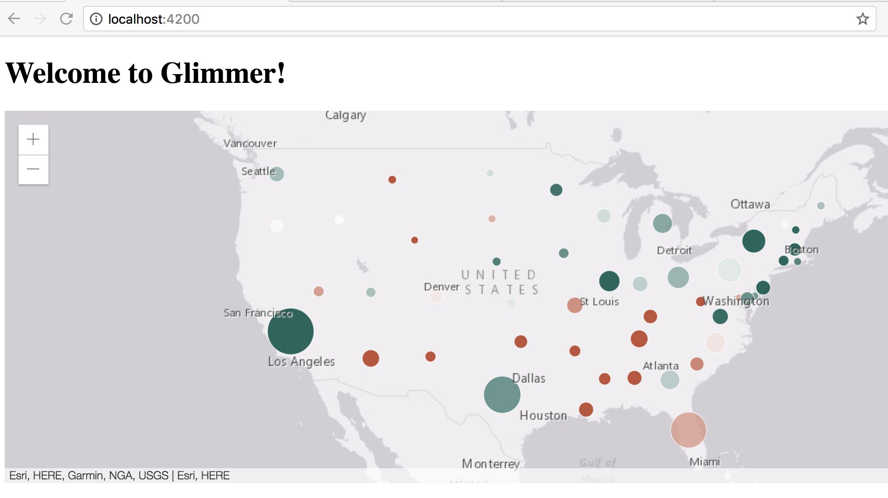

# esri-glimmer-example

An example of how to use the [ArcGIS API for JavaScript] in a [glimmerjs] application.

This uses the pattern (and a copy of the code) from [esri-loader](https://github.com/Esri/esri-loader) to lazy-load the ArcGIS API for JavaScript in a glimmer app. 

This is a work in progress hacked up w/ [@odoe](https://github.com/odoe/) at EmberConf 2017.

## Development Instructions

The rest of this README outlines the details of collaborating on this Glimmer application.

### Prerequisites

You will need the following things properly installed on your computer.

* [Git](https://git-scm.com/)
* [Node.js](https://nodejs.org/) (with NPM)
* [Yarn](https://yarnpkg.com/en/)
* [Ember CLI](https://ember-cli.com/)

### Installation

* `git clone <repository-url>` this repository
* `cd esri-glimmer-example`
* `yarn`

### Running / Development

* `ember serve`
* Visit your app at [http://localhost:4200](http://localhost:4200).

### Building

* `ember build` (development)
* `ember build --environment production` (production)

## Further Reading / Useful Links

* [ArcGIS API for JavaScript]
* [glimmerjs]
* [ember-cli](https://ember-cli.com/)

* [ArcGIS API for JavaScript]:https://developers.arcgis.com/javascript/
* [glimmerjs]:https://glimmerjs.com/
